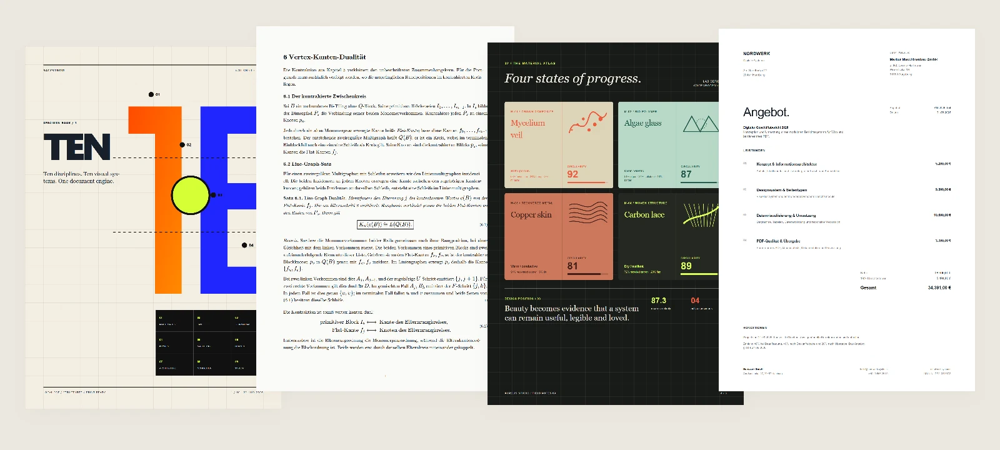
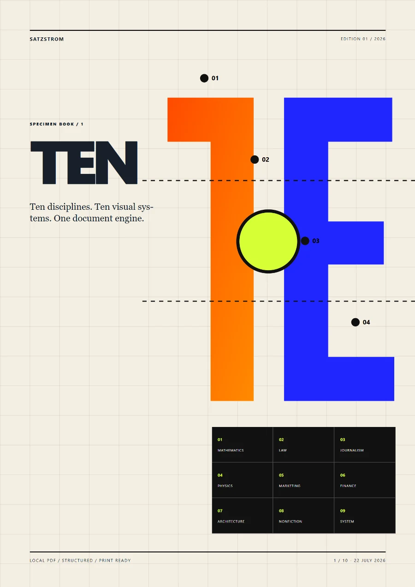
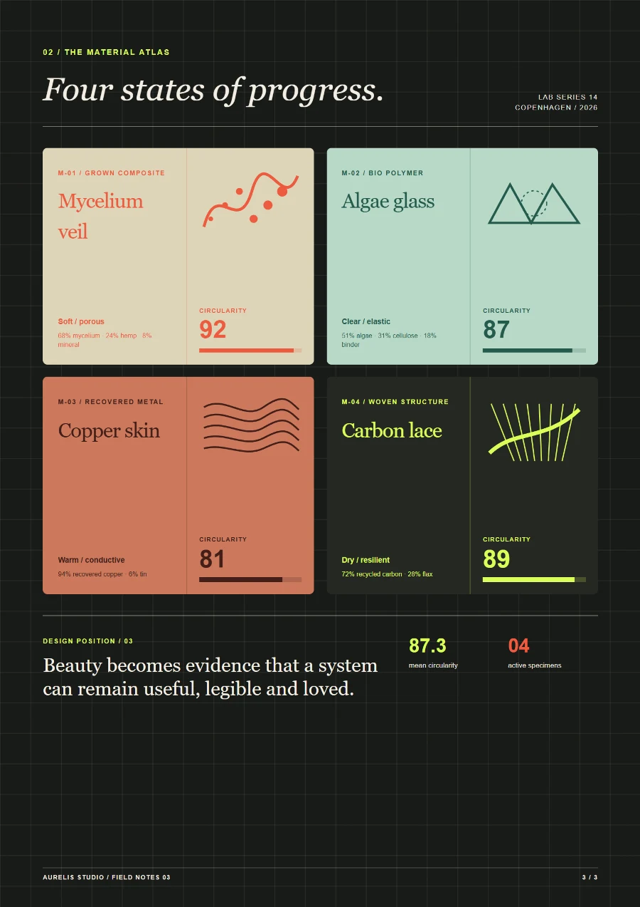
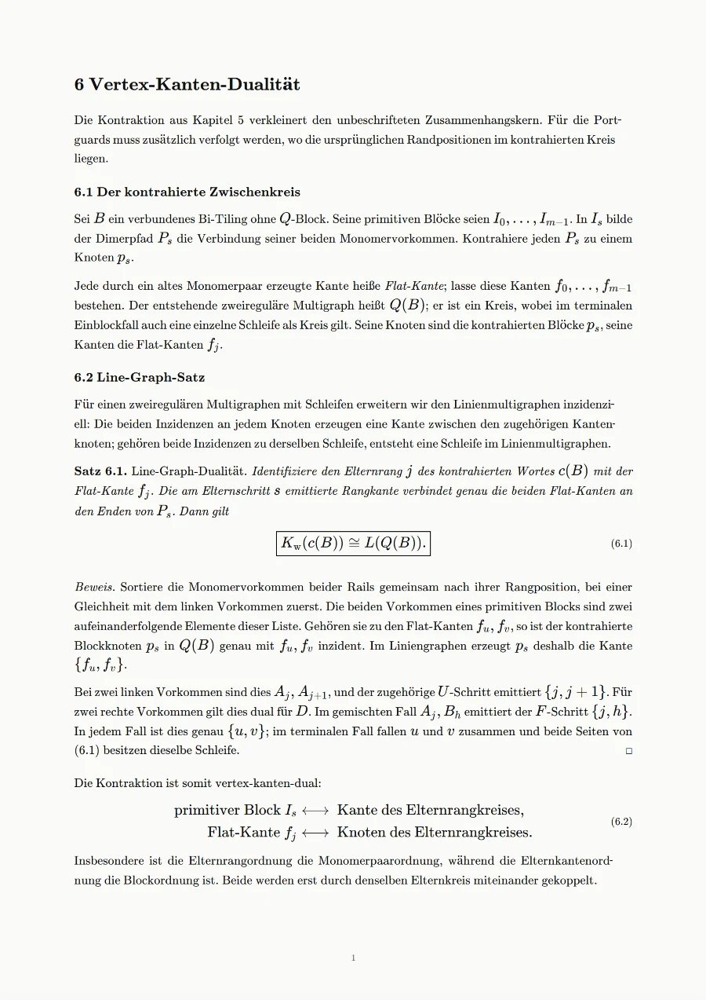
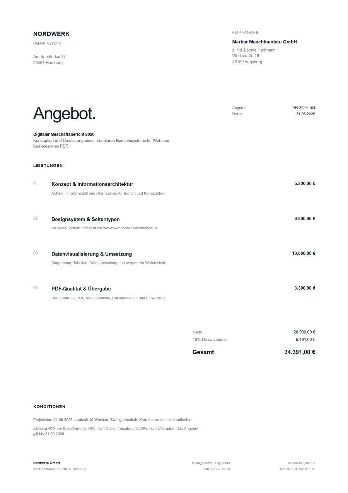

# Satzstrom

**Build documents like software.**

Satzstrom is a local rendering engine that turns ordinary React projects into precisely paginated PDFs with professional typesetting.

Keep React, TypeScript, semantic HTML, CSS, data, and the libraries you already use. Satzstrom adds physical pages, flowing layouts, document structure, layout diagnostics, and final PDF output.

[Website](https://satzstrom.com) · [Quickstart](#quickstart) · [Documentation](#documentation) · [Examples](#examples)



_Actual pages rendered with Satzstrom. Each document uses its own React components, data, page formats, and styles._

Satzstrom is designed for reports, invoices, manuals, research papers, books, board packs, and other documents whose content comes from code or structured data.

## Quickstart

Satzstrom requires Node.js 20 or later.

```sh
npm install -g satzstrom
satzstrom init my-document
```

`init` creates and installs a complete React document project.

Open the live paginated preview to develop against the actual page layout. It uses the same pagination as the final PDF, updates when source files, styles, data, or assets change, and shows layout problems while you work.

```sh
satzstrom dev my-document/document.tsx
```

On its first run, `dev` also completes the required local runtime setup automatically.

Create the final PDF with:

```sh
satzstrom render my-document/document.tsx
```

Without an explicit output path, Satzstrom writes `document.pdf` beside the source document. Rendering happens locally without a cloud rendering service or telemetry.

## A document is a React component

Satzstrom does not introduce a separate document language. A document is a normal React component built with JSX, semantic HTML, CSS, and the dependencies selected by its project.

```tsx
import { Document, Flow, PageMaster } from "@satzstrom/primitives";

function PageLayout() {
  return (
    <div style={{ display: "flex", flexDirection: "column", height: "100%" }}>
      <header>Header</header>
      <Flow style={{ flex: 1 }} />
      <footer>Footer</footer>
    </div>
  );
}

export default function Report() {
  return (
    <Document title="Report" lang="en">
      <PageMaster size="A4" layout={PageLayout}>
        <h1>Report</h1>
        <p>Content that flows across pages.</p>
      </PageMaster>
    </Document>
  );
}
```

`PageMaster` lets content flow through a reusable React page frame. Its optional layout places exactly one empty `Flow` alongside recurring headers, footers, sidebars, decorations, and page numbers. The layout above fills the page, then uses Flexbox to give `Flow` the remaining height. Without a layout, the whole page is the flow area.

Satzstrom bundles stylesheets imported by the document or its components. The filename and project structure are up to you. Hooks, component libraries, fonts, PostCSS, browser-compatible packages, and project-specific design systems remain normal parts of the React project.

Documents may be parameterless or data-driven. Define ordinary TypeScript props on the default component and pass an object explicitly through `--args` or `--data`. Satzstrom passes those fields directly as component props; named exports have no special runtime meaning.

Existing Markdown content can be rendered as semantic HTML through the optional `Markdown` primitive. JSX remains the surrounding document model.

## A page-aware layout model

Satzstrom understands paper formats, recurring page frames, available content regions, and the remaining space on each page.

Fixed pages and flowing sections can coexist in the same document. A cover may use `Page`, the body may flow through a `PageMaster`, and a later foldout may switch to A3 landscape. Page numbering remains global throughout the document.

Paragraphs are split between composed lines, tables between rows, and lists between their items. Long table rows, list items, and footnotes can continue onto later pages. Normal nested containers retain their React structure and CSS across page boundaries.

Standard CSS break rules keep related content together. Structures that cannot be fragmented safely remain atomic and produce a layout diagnostic.

## What Satzstrom adds

| Area               | Capabilities                                                                                                                               |
| ------------------ | ------------------------------------------------------------------------------------------------------------------------------------------ |
| Physical pages     | A0–A5, Letter, Legal, custom dimensions, portrait and landscape, mixed formats, bleed, trim geometry, and crop marks                       |
| Pagination         | Fixed pages, flowing page masters, page breaks, recurring regions, fragmented containers, tables, lists, columns, floats, and footnotes    |
| Typesetting        | Paragraph-wide line composition, controlled spacing, TeX hyphenation for English and German, widows and orphans, CJK, RTL, and mathematics |
| Document structure | Hierarchical numbering, contents, references, page targets, footnotes, and PDF bookmarks                                                   |
| PDF output         | Tagged PDFs, selectable text, PDF/A-2a, PDF/UA-1, metadata, links, and accessible structure derived from semantic HTML                     |
| Local tools        | Paginated preview, strict checks, page inspection, debug rendering, final PDF output, and a local MCP server                               |

The public React primitives focus on physical or document-semantic structure:

`Document`, `Page`, `PageMaster`, `Flow`, `PageBreak`, `RepeatBox`, `Sequence`, `Contents`, `Ref`, `Footnote`, `Math`, `Markdown`, and `useRenderReady`.

Everything else remains ordinary React composition.

## The authoring loop

### Write

Work in `document.tsx`, imported components, styles, assets, and data files.

### Preview

```sh
satzstrom dev documents/report.tsx --data documents/report.json
```

The local preview shows the paginated document, page thumbnails, zoom controls, and layout diagnostics. Changes to source files, CSS, data, and local assets update the preview.

### Check and inspect

```sh
satzstrom check documents/report.tsx --strict

satzstrom inspect documents/report.tsx \
  --start-page 2 \
  --end-page 4 \
  --images \
  --debug
```

`check` reports the page count and concrete layout issues. Strict mode turns layout warnings into failures.

`inspect` returns selected pages as PNG images, visible text, or both. Debug images show page regions, fragment boundaries, keep rules, and overflows.

### Render

```sh
satzstrom render documents/report.tsx \
  --out dist/report.pdf \
  --strict
```

The final render uses the same document state and pagination as preview and inspection.

## Local tools for agents

Satzstrom exposes its authoring workflow through a local stdio MCP server:

```sh
satzstrom mcp
```

The server provides five focused tools:

- `init` creates a document project.
- `add` adds one document to an existing TypeScript project.
- `check` returns its page count and actionable layout issues.
- `inspect` returns selected pages as images or visible text.
- `render` writes the final PDF.

An agent can edit the normal React source, check the resulting layout, inspect exact pages visually, and refine the document without access to the private renderer implementation.

For Codex, the server can be registered with:

```sh
codex mcp add satzstrom -- satzstrom mcp
```

MCP is an additional local interface. Every workflow remains available directly through the CLI.

See the [MCP guide](https://satzstrom.com/docs/mcp) for client configuration and the agent setup workflow.

## PDF output

Satzstrom creates tagged PDFs from the same semantic HTML used for visible content. Text remains selectable in logical document order.

Archive and accessibility profiles can be enabled independently or together:

```sh
satzstrom render report.tsx \
  --out report.pdf \
  --pdfa 2a \
  --pdfua 1 \
  --strict
```

PDF/A-2a and PDF/UA-1 output is validated against veraPDF during Satzstrom’s conformance tests.

Accessible output still depends on accurate document metadata, semantic HTML, useful alternative text, accessible link names, and the correct document language. Decorative repeated headers and footers should be marked with `aria-hidden="true"`.

Satzstrom currently produces sRGB output. CMYK separation, spot colors, and PDF/X are outside the current output model.

## Examples

<table>
  <tr>
    <td width="50%" valign="top">
      
    </td>
    <td width="50%" valign="top">
      
    </td>
  </tr>
  <tr>
    <td width="50%" valign="top">
      
    </td>
    <td width="50%" valign="top">
      
    </td>
  </tr>
</table>

These are rendered documents, not design mockups. See more output on the [examples page](https://satzstrom.com/examples).

The public repository contains the complete sources for all six gallery documents, a shared page frame, and a small [starter project](./examples/starter). Follow the [example guide](./examples/README.md) to run the invoice end to end or open any other gallery project.

## Public preview

Satzstrom 0.1.2 is a public preview. Breaking changes may occur during the `0.x` series and are documented in the [changelog](./CHANGELOG.md) with migration notes.

Supported platforms are:

- Windows x64
- Linux x64

Preview binaries are currently unsigned. Release artifacts include SHA-256 checksums.

Some complex CSS structures cannot yet be fragmented safely. Transformed or clipped containers, sticky layouts, dense grids, grid template areas, and grid rows spanning multiple tracks remain atomic and produce a diagnostic when necessary.

See the [public preview](https://satzstrom.com/preview) for the complete current scope.

## Documentation

- [Introduction](https://satzstrom.com/)
- [Setup and quickstart](https://satzstrom.com/quickstart)
- [Authoring guide](https://satzstrom.com/docs)
- [React primitives](./packages/primitives/README.md)
- [Agent and MCP setup](https://satzstrom.com/docs/mcp)
- [Known limitations](https://satzstrom.com/preview)
- [Changelog](./CHANGELOG.md)

The official [Satzstrom skill](./skills/satzstrom/SKILL.md) gives coding agents the same authoring model and local inspection workflow.

## Repository and licensing

This repository contains the public parts of Satzstrom Community Edition:

- The React primitives
- The cross-platform CLI launcher
- Documentation
- The Satzstrom skill
- Six complete gallery examples and a starter example
- Public tests and CI

These files are licensed under the [MIT License](./LICENSE).

The native Satzstrom renderer is installed separately through platform-specific npm packages and is licensed under the [Satzstrom Community Binary License](./COMMUNITY-LICENSE.md). Its proprietary implementation is not part of this repository.

The Community Binary License permits personal work, manual commercial work, and automated development or testing. Automated commercial production use, including servers, APIs, scheduled jobs, batch generation, and customer-document generation, requires a separate Enterprise license.

For Enterprise licensing, contact [lukas@lb-engineering.org](mailto:lukas@lb-engineering.org).

This repository is an audited community export. Accepted public contributions are integrated with attribution and returned through a fresh audited export.

## Contributing

Bug reports, documentation improvements, examples, and changes to the public packages are welcome.

Read [CONTRIBUTING.md](./CONTRIBUTING.md) before beginning substantial work.

## Support and security

Satzstrom 0.1.2 has community support without an SLA. See [SUPPORT.md](./SUPPORT.md) when reporting a problem.

Please report vulnerabilities privately through GitHub Private Vulnerability Reporting. See [SECURITY.md](./SECURITY.md) for details.
